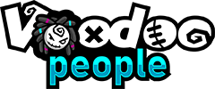

### These components were developed in partnership with [Planet Voodoo® (Voodoo LLC)](https://planetvoodoo.org/) as part of their 'WebXR Wizardry' initiative.

### Model vertices to particles:

[Docs](./model-to-particles) 
[Example](https://gftruj.github.io/webzamples/PlanetVoodoo/model-to-particles)

### Reflection components

[Docs](./reflection) 
[Example](https://gftruj.github.io/webzamples/PlanetVoodoo/reflection)

### model material modification

[Docs](./material-modifier) 
[Example](https://gftruj.github.io/webzamples/PlanetVoodoo/material-modifier)

