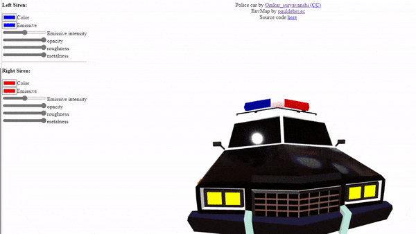

### This component was developed in partnership with [Planet Voodoo® (Voodoo LLC)](https://planetvoodoo.org/) as part of their 'WebXR Wizardry' initiative.

### material-modifier

Material changes in a specific material node.

#### usage

    The components expects the material name to be in the component id: `material-modifier__<MATERIAL_NAME>`

    
    <a-scene>
      <a-entity gltf-model="./model.gltf" material-modifier__Left_Siren="emissive: 0xff0000"></a-entity>
    </a-scene>
 
Update with `setAttribute("material_modifier__<MATERIAL_NAME>", "property", value);`
 
#### Attributes

| Attribute         | type          |
| -------------     |:-------------:| 
| color             | hex           | 
| emissive          | hex           | 
| emissiveIntensity | number        | 
| opacity           | number        | 
| roughness         | number        | 
| metalness         | number        | 
| opacity           | number        | 

#### Example

Check out the interactive [example](https://gftruj.github.io/webzamples/PlanetVoodoo/material-modifier):

