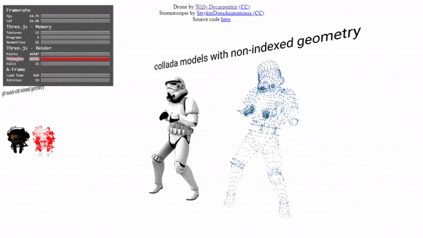

### This component was developed in partnership with [Planet Voodoo® (Voodoo LLC)](https://planetvoodoo.org/) as part of their 'WebXR Wizardry' initiative.

### model-to-particles

The component creates a particle for each vertice in a skinned mesh. 

#### usage

    
    <a-scene>
      <a-entity gltf-model="./model.gltf" model-to-particles></a-entity>
    </a-scene>
  
#### properties

| Property      | default       |
| ------------- |:-------------:| 
| color         | 0xff0000      | 
| particleSize  | 0.01          | 
| showModel     | false         | 

#### Example

The component is used with models with both indexed and non-indexed geometries in [this example](https://gftruj.github.io/webzamples/PlanetVoodoo/model-to-particles):

#### todo
- pre-compute geometries ( FPS vs Memory usage).
- throttle tick
- particle density limits
- ignore vertices that are closer than `d`
- scatter instead of mapping vertices to points
