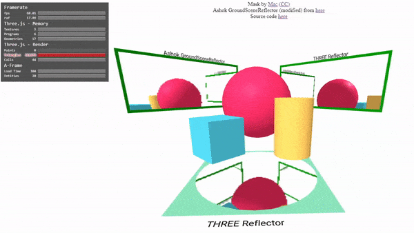

### This component was developed in partnership with [Planet Voodoo® (Voodoo LLC)](https://planetvoodoo.org/) as part of their 'WebXR Wizardry' initiative.

### aalavandhaann work disclaimer.

The `Ashok.GroundSceneReflector`, and `aframe-mirror` component which are created by [aalavandhaann](https://github.com/aalavandhaann/three_reflector).
The source files are modified (renderer warnings etc.), you can use them as intended:

    <script src="https://gftruj.github.io/webzamples/PlanetVoodoo/reflection/src/ashok_reflector.js">
    <a-scene>
      <a-plane aframe-mirror></a-plane>
    </a-scene>

### Pure (ish) THREE.Reflector

a-frame wrapper around the `THREE.Reflector` object.
Usage:

    <script src="https://gftruj.github.io/webzamples/PlanetVoodoo/reflection/dist/reflector-component.js">
    <a-scene>
        <a-plane reflector="clipBias: 0; useWindowDimensions: true"></a-plane>
    </a-scene>
    
### Example

Both components are used in [this example](https://gftruj.github.io/webzamples/PlanetVoodoo/reflection):

