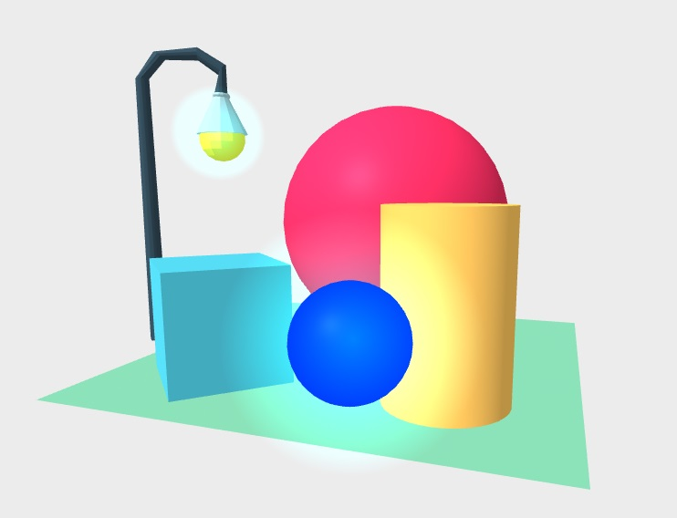

### This component was developed in partnership with [Planet Voodoo® (Voodoo LLC)](https://planetvoodoo.org/) as part of their 'WebXR Wizardry' initiative.

## WIP

The component is working, but it's in a work - in - progress state.

## simple glow

Based on the <a href="https://github.com/stemkoski/stemkoski.github.com/blob/master/Three.js/Shader-Glow.html">work of Lee Stemkoski</a>
Although not using sprites.

### Usage

Attach the component to any primitive, or gltf model:

    <script src="https://gftruj.github.io/webzamples/PlanetVoodoo/simple-glow/simple-glow.js"
    <a-scene>
      <a-sphere simple-glow></a-sphere>
    </a-scene>

<a href="https://gftruj.github.io/webzamples/PlanetVoodoo/simple-glow/index.html">Example here</a>

### Properties

| Property        | Default       |
| -------------   |:-------------:|
| glowTexture     | ""            |
| color           | #0ff          | 
| intensity       | 0.5           |

### Notes

The glow material uses `THREE.AdditiveBlending` so it looks good with darker backgrounds. 

Why not sprites ? Check out the difference here - <a href="https://gftruj.github.io/webzamples/PlanetVoodoo/simple-glow/index.html">standard object (current)</a> vs
 <a href="https://gftruj.github.io/webzamples/PlanetVoodoo/simple-glow/stemkoski-based/index.html">sprite</a>
