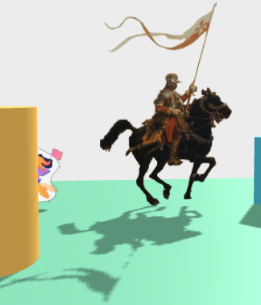

### depth-material

A very basic `a-frame` component utilizing the [MeshDepthMaterial](https://threejs.org/docs/index.html?q=MeshDepthMaterial#api/en/materials/MeshDepthMaterial) to generate 
proper shadows from transparent textures.

### usage

Attach the scripts, and the component:

    
    
    <a-scene>
      <a-plane shadow material="src: #image; side: double; transparent: true" depth-material>
    </a-scene>
    
Check it out in this [example](https://gftruj.github.io/webzamples/aframe/depth-material/) (static image + lottie animation):

