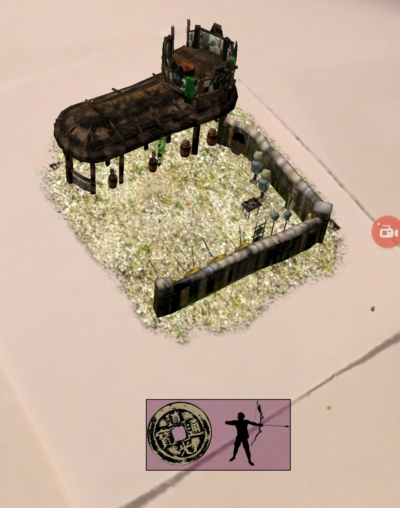

## tracked-ui

Place the component on the marker element, and provide a html element which should follow the marker!

### usage 
    
      
      

      <a-scene>
         <!-- element: html element selector, offset: x,y offset in pixels -->
         <a-marker tracked-ui="element: #UI; offset: 0 200"></a-marker>

### example

Check it out [here](https://gftruj.github.io/webzamples/arjs/tracked-ui/)  

The UI should be following the marker. Clicking the coin will toggle the marketplace model, clicking the archer will toggle the archery-range model:

https://user-images.githubusercontent.com/17348360/131051570-286a4518-a6f8-47da-ad69-54e10871bcec.mp4

Raw code warning, inline styles, probably needs to be more beginner friendly. 

Models by <a href="https://sketchfab.com/StanislasDolcini">StanislasDolcini</a>:
<a href="https://sketchfab.com/models/f925a85a10d8451fb523121058564459">Range</a>,
 <a href="https://sketchfab.com/models/51a94cabda344ebcb579476b16296dfb">Market</a>
<a href="http://creativecommons.org/licenses/by-sa/4.0/">(CC-BY-SA-4.0)</a>

openclipart icons -
<a href="https://openclipart.org/detail/252262/male-archer-silhouette">archer</a>,
<a href="https://openclipart.org/detail/319535/chinese-coin">coin</a>
